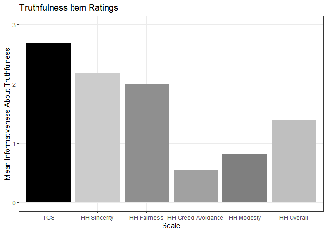
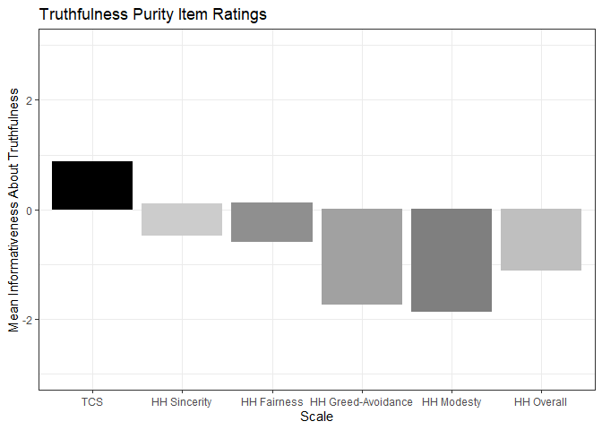

Portfolio 10 – Recreating a Bar Plot
================
Ryan Wheat
05/05/2023

\##Background

I’ve done some relatively lengthy portfolios recently, so today, I’m
going to take it down a notch: I’m going to try to make some visuals
using ggplot.

First, I’m going to utilize data from my first year project for this
purpose. In this study, we examined the content validity of a new
honesty scale – the Truthful Communication Scale (TCS) – by comparing
the face validity of its items against those of another “honesty” scale,
Honesty-Humility (HH).

Participants were asked to rate the extent to which each item from both
scales reflected (1) truthfulness, (2) manipulativeness, (3)
law-breaking, (4) greed, (5) modesty. Lets plot those results.

``` r
#create long dataset to compare truthfulness ratings

Item_Ratings_Long1 <- Item_Ratings %>%
  mutate(Participant = c(1:152)) %>%
  select(206, 200:205) %>%
  pivot_longer(!Participant, names_to = "Scale", values_to = "Avg_Tru_Rating")

#make new variable with better label for plotting

Item_Ratings_Long1 <- Item_Ratings_Long1 %>%
  mutate(ggplot_name = case_when(Scale == "Sin_Tru" ~ "HH Sincerity",
                                 Scale == "Fair_Tru" ~ "HH Fairness",
                                 Scale == "Greed_Tru" ~ "HH Greed-Avoidance",
                                 Scale == "Mod_Tru" ~ "HH Modesty",
                                 Scale == "TCS_Tru" ~ "TCS",
                                 Scale == "HH_Tru" ~ "HH Overall"))

Item_Ratings_Long1$ggplot_name <- factor(Item_Ratings_Long1$ggplot_name, levels = c("TCS", "HH Sincerity", "HH Fairness", "HH Greed-Avoidance", "HH Modesty", "HH Overall"))

ci_upper <- function(x) {
  sd <- sd(x)
  se <- sd / sqrt(length(x))
  ci <- mean(x) + (1.96 * se)
  return(ci)
}

ci_lower <- function(x) {
  sd <- sd(x)
  se <- sd / sqrt(length(x))
  ci <- mean(x) - (1.96 * se)
  return(ci)
}

TCS_upper <- ci_upper(Item_Ratings$TCS_Tru)
TCS_lower <- ci_lower(Item_Ratings$TCS_Tru)

Sin_upper <- ci_upper(Item_Ratings$Sin_Tru)
Sin_lower <- ci_lower(Item_Ratings$Sin_Tru)

Fair_upper <- ci_upper(Item_Ratings$Fair_Tru)
Fair_lower <- ci_lower(Item_Ratings$Fair_Tru)

Greed_upper <- ci_upper(Item_Ratings$Greed_Tru)
Greed_lower <- ci_lower(Item_Ratings$Greed_Tru)

Mod_upper <- ci_upper(Item_Ratings$Mod_Tru)
Mod_lower <- ci_lower(Item_Ratings$Mod_Tru)

HH_upper <- ci_upper(Item_Ratings$HH_Tru)
HH_lower <- ci_lower(Item_Ratings$HH_Tru)

#make plot

ggplot(Item_Ratings_Long1, aes(x = ggplot_name, y = (Avg_Tru_Rating / 152), fill = ggplot_name)) +
  geom_col() +
  theme_bw() +
  theme(legend.position = "none") +
  coord_cartesian(ylim = c(0, 3)) +
  scale_fill_manual(label = NULL, values = c("black", "gray80", "gray56", "gray63", "gray50", "gray75")) +
  labs(title = "Truthfulness Item Ratings",
       x = "Scale",
       y = "Mean Informativeness About Truthfulness",
       fill = NULL)
```

<!-- -->

This plot shows that TCS items are more face-valid for truthfulness than
HH items are. But what about comparing the difference between the
validity of items on truthfulness vs. other relevant constructs?

I created a variable to reflect such a difference called “Pure
Truthfulness.” This is a difference score, such that ratings above zero
on this variable indicate that an item reflects truthfulness MORE THAN
some other construct (e.g., manipulativeness, law-breaking, greed,
modesty) that may ostensibly be related to these items.

``` r
#create long dataset to compare pure truthfulness ratings

Item_Ratings_Long2 <- Item_Ratings %>%
  mutate(Participant = c(1:152)) %>%
  select(206, 194:199) %>%
  pivot_longer(!Participant, names_to = "Scale", values_to = "Avg_Pure_Rating")

#make new variable with better label for plotting

Item_Ratings_Long2 <- Item_Ratings_Long2 %>%
  mutate(ggplot_name = case_when(Scale == "Sinpure" ~ "HH Sincerity",
                                 Scale == "Fairpure" ~ "HH Fairness",
                                 Scale == "Greedpure" ~ "HH Greed-Avoidance",
                                 Scale == "Modpure" ~ "HH Modesty",
                                 Scale == "TCpure" ~ "TCS",
                                 Scale == "HHpure" ~ "HH Overall"))

Item_Ratings_Long2$ggplot_name <- factor(Item_Ratings_Long2$ggplot_name, levels = c("TCS", "HH Sincerity", "HH Fairness", "HH Greed-Avoidance", "HH Modesty", "HH Overall"))


TCpure_upper <- ci_upper(Item_Ratings$TCpure)
TCpure_lower <- ci_lower(Item_Ratings$TCpure)
Sinpure_upper <- ci_upper(Item_Ratings$Sinpure)
Sinpure_lower <- ci_lower(Item_Ratings$Sinpure)
Fairpure_upper <- ci_upper(Item_Ratings$Fairpure)
Fairpure_lower <- ci_lower(Item_Ratings$Fairpure)
Greedpure_upper <- ci_upper(Item_Ratings$Greedpure)
Greedpure_lower <- ci_lower(Item_Ratings$Greedpure)
Modpure_upper <- ci_upper(Item_Ratings$Modpure)
Modpure_lower <- ci_lower(Item_Ratings$Modpure)
HHpure_upper <- ci_upper(Item_Ratings$HHpure)
HHpure_lower <- ci_lower(Item_Ratings$HHpure)

#make plot

ggplot(Item_Ratings_Long2, aes(x = ggplot_name, y = (Avg_Pure_Rating / 152), fill = ggplot_name)) +
  geom_col() +
  theme_bw() +
  theme(legend.position = "none") +
  coord_cartesian(ylim = c(-3, 3)) +
  scale_fill_manual(label = NULL, values = c("black", "gray80", "gray56", "gray63", "gray50", "gray75")) +
  labs(title = "Truthfulness Purity Item Ratings",
       x = "Scale",
       y = "Mean Informativeness About Truthfulness",
       fill = NULL)
```

<!-- -->

This plot reveals that, not only do people rate TCS items to reflect
truthfulness more than other constructs, it is the only scale (of those
included in this study) which does so!

One more plot: let’s look at these as violins.

``` r
#Overall Truthfulness

ggplot(Item_Ratings_Long1, aes(x = ggplot_name, y = Avg_Tru_Rating, fill = ggplot_name)) +
  geom_violin() +
  theme_bw() +
  theme(legend.position = "none") +
  coord_cartesian(ylim = c(0, 3)) +
  stat_summary(fun = "mean",
               geom = "crossbar",
               na.rm = TRUE) +
  scale_fill_manual(label = NULL, values = c("black", "gray80", "gray56", "gray63", "gray50", "gray75")) +
  labs(title = "Truthfulness Item Ratings",
       x = "Scale",
       y = "Mean Informativeness About Truthfulness",
       fill = NULL)
```

<!-- -->

``` r
#Pure Truthfulness

ggplot(Item_Ratings_Long2, aes(x = ggplot_name, y = Avg_Pure_Rating, fill = ggplot_name)) +
  geom_violin() +
  theme_bw() +
  theme(legend.position = "none") +
  coord_cartesian(ylim = c(-3, 3)) +
  stat_summary(fun = "mean",
               geom = "crossbar",
               na.rm = TRUE) +
  scale_fill_manual(label = NULL, values = c("black", "gray80", "gray56", "gray63", "gray50", "gray75")) +
  labs(title = "Truthfulness Purity Item Ratings",
       x = "Scale",
       y = "Mean Informativeness About Truthfulness",
       fill = NULL)
```

<!-- -->
